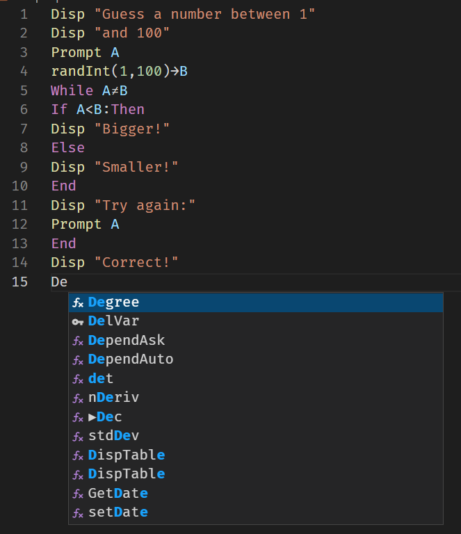

# ti-basic-autocomplete

Have you ever had the urge to write code in [TI-Basic](https://en.wikipedia.org/wiki/TI-BASIC)? Me too! With this package you can now program in TI-Basic and get autocompletion and syntax highlighting for your code (in VSCode). Note this is my first time writing a VSCode extension, so there may be some bugs or some bad practices. If you have any feedback, please let me know!

[Some things to take in mind using this extension!](https://github.com/beastmatser/ti-basic-autocomplete/wiki)

Anyways to use the extension, just install it and then open a filewith the `.8xp` extension, which you can upload to your calculator. If everything works correctly, you should have autocompletion and syntax highlighting for your code.

ti-basic-autocomplete in action:

